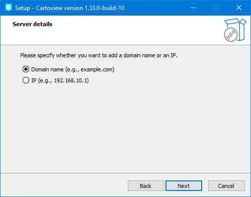
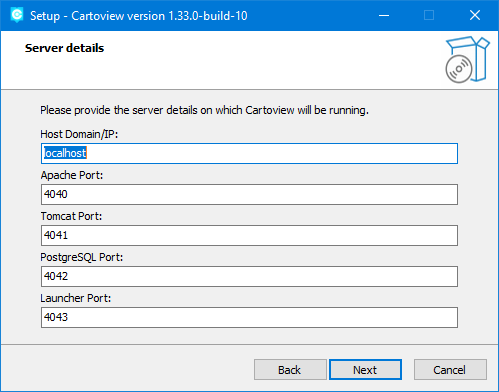
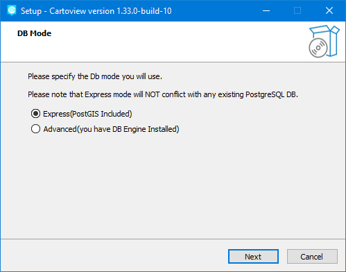
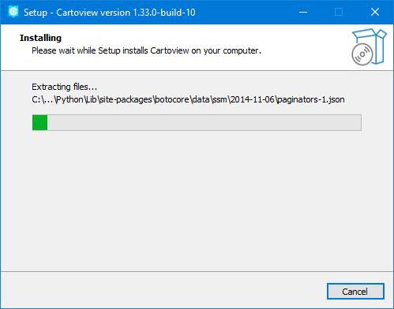
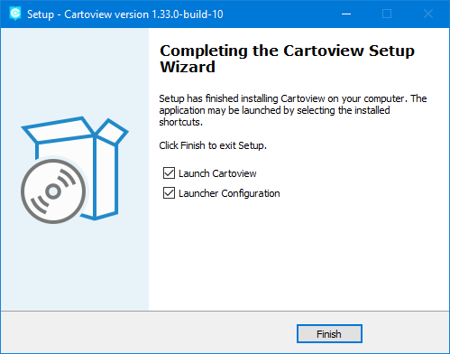
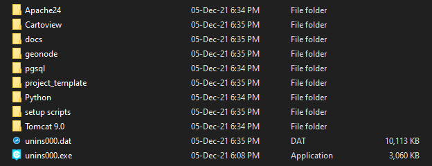

# Cartoview Windows Installer

## Introduction
Cartoview has a Windows installer that gives you an up and running instance, having Cartoview, GeoNode, GeoServer, and PostgreSQL (PostGIS) installed on the fly.

This guide describes the steps of installing and running Cartoview installer **v1.31.0**.

--- 

## Installation

### Request Cartoview Installer
The installer can be requested and downloaded from [here](https://cartoview.net/download/). 

You just need to provide your information, select a version of Cartoview to download, and you should get an e-mail with the installer download link.

!!! note
    It's recommended to stick with the latest version which is selected by default.

Download the installer on your Windows machine. You should get an executable file like that, **Cartoview_1.31.0.exe**.

### Installer Steps
Proceed with the steps to install and run Cartoview.

!!! note
    It's optional whether to stick with the default configurations during this installation or make changes according to your needs.

Specify whether you want to use a **domain name** (e.g. localhost, example.com) or an **IP** (e.g. 192.168.10.1). We will stick with the default **domain name** to run on localhost.



Provide the details of the server on which cartoview will be running.

```text
Host Domain: The domain that will be used, localhost or any domain name you want.
Apache Port: Cartoview port.
Tomcat Port: GeoServer port.
PostgreSQL Port: Database port.
```



Specify whether to use the database with **Express** mode which installs and runs PostgreSQL on the fly or **Advanced** mode which uses a running instance of PostgreSQL.

If you select the **Advanced** mode, you will be required to provide the installation directory of PostgreSQL on your machine, the database server credentials (e.g. domain, port, username, and password) and databases names.

We will stick with **Express** mode.



Select location of installation on your machine.


Click **Next** and wait for the installation to finish.



!!! note
    You may be prompted that Windows Defender Firewall has blocked some features, please **Allow access**.

After installing, check **Launch Cartoview** option. The **Admin** page will also open.



This will open Cartoview in the browser at [http://localhost:4040/](http://localhost:4040/).


And the [Admin](http://localhost:4040/docs/admin.html) page.


--- 

## Post-Installation Notes

Congratulations! Cartoview is now installed successfully.

You can upload layers, create maps, and install Cartoview apps to visualize and interact with these maps.

### Install Apps

Once Cartoview is installed, You can navigate to [http://localhost:4040/apps/](http://localhost:4040/apps/) to check and install all available apps from the [App Store](https://appstore.cartoview.net/).

After installing any app, you may need to restart the running **Apache Windows service** if you can't see your app in `/apps`.


### Customize the Look and Feel

Navigate to the location where cartoview is installed on you machine, by default it can be found at `C:\Program Files (x86)\Cartoview`.

You should find all the installed services, Cartoview, GeoNode, Python, PostgreSQL, etc.



You now have a control on the appearance of Cartoview as being able to add and customize the available content (e.g. CSS and other static files, templates, models, etc.) using `project_template` directory.

For more information regarding Cartoview & GeoNode theming, please follow [this guide](https://docs.geonode.org/en/master/basic/theme/index.html#geonode-themes) provided by GeoNode.

### Quick Links


### Admin Configuration

You can find at the [Admin Configuration](http://localhost:4040/docs/docs.html) page the details of each installed service (e.g. Default credentials, Windows service name, and installed version).


And a guide about how to publish Cartoview on a Windows server.


