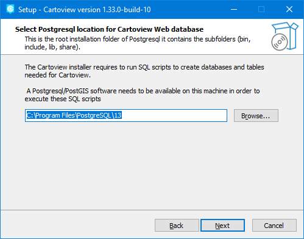
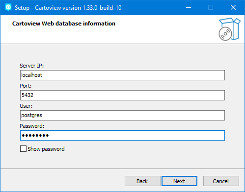
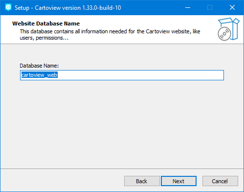
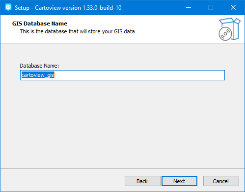
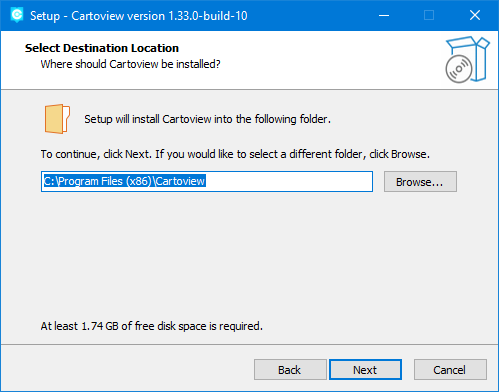
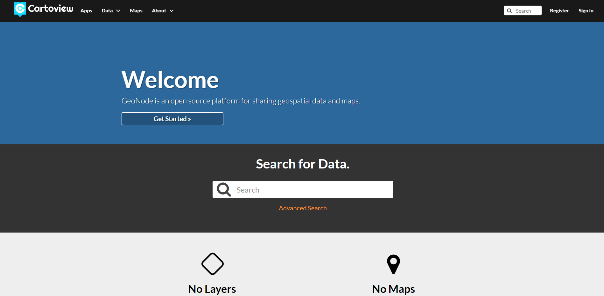
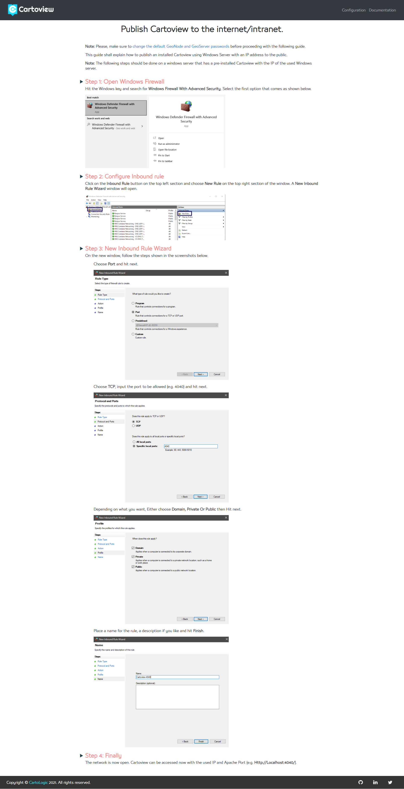
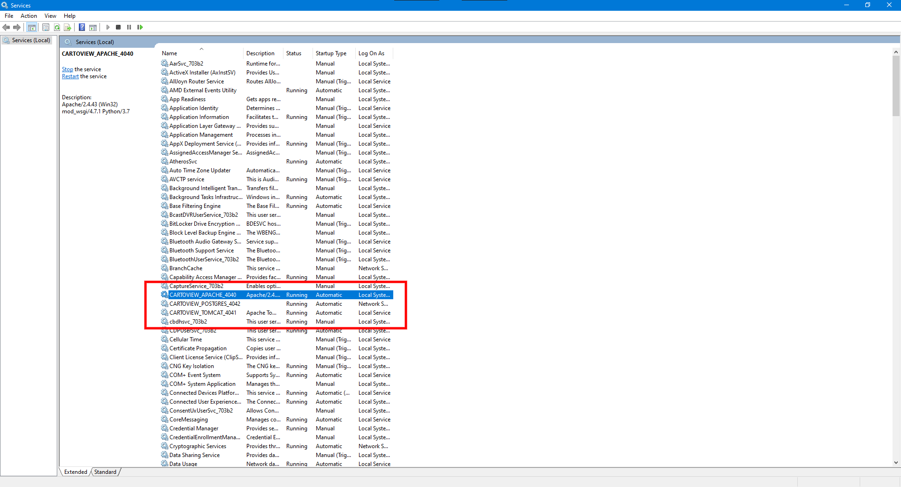
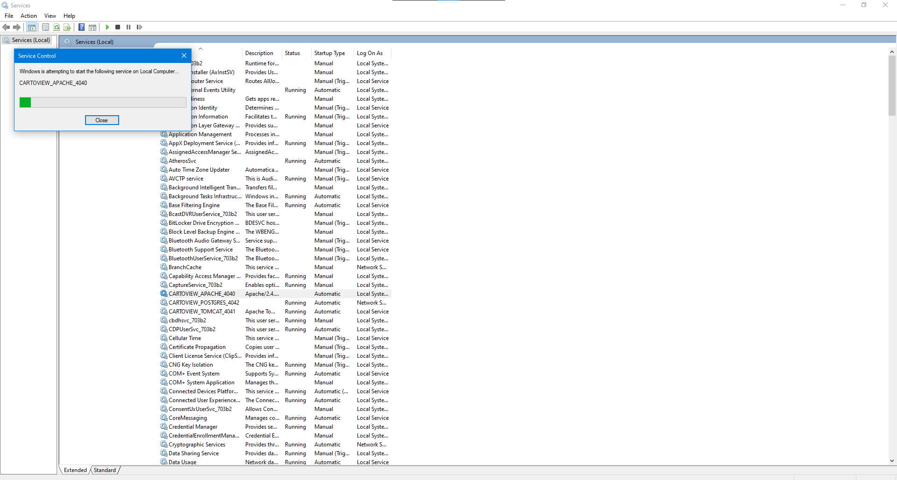

# Cartoview Windows Installer

## Introduction
Cartoview has a Windows installer that gives you an up and running instance, having Cartoview, GeoNode, GeoServer, and PostgreSQL (PostGIS) installed on the fly.

This guide describes the steps of installing and running Cartoview installer **v1.33.0**.

--- 

## Installation

### Request Cartoview Installer
The installer can be requested and downloaded from [here](https://cartoview.net/download/). 

You just need to provide your information, select a version of Cartoview to download, and you should get an e-mail with the installer download link.

Download the installer on your Windows machine. You should get an executable file like that, **Cartoview_1.33.0.exe**.

### Installer Steps
Proceed with the steps to install and run Cartoview.

!!! note
    It's optional whether to stick with the default configurations during this installation or make changes according to your needs.

Specify whether to use the database with **Express** mode which installs and runs PostgreSQL on the fly or **Advanced** mode which uses an already running instance of PostgreSQL on your machine.

!!! note
    If you select the **Advanced** mode, you will be required to provide the installation directory of PostgreSQL on your machine, the credentials and databases names.

    
    
    
    
    
    
    

We will stick with **Express** mode.


Specify whether you want to use a **domain name** (e.g. localhost, example.com) or an **IP** (e.g. 192.168.10.1). We will stick with the default **domain name** to run on localhost.


Provide the details of the server on which cartoview will be running.

```text
Host Domain: The domain that will be used, localhost or any domain name you want.
Apache Port: Cartoview port.
Tomcat Port: GeoServer port.
PostgreSQL Port: Database port.
```


Select location of installation on your machine.



Click **Next** and wait for the installation to finish.


!!! note
    You may be prompted that Windows Defender Firewall has blocked some features, please **Allow access**.

After installing, check **Launch Cartoview** option. The **Admin** page will also open.


This will open Cartoview in the browser at [http://localhost:4040/](http://localhost:4040/).



And the [Admin](http://localhost:4040/docs/admin.html) page.


--- 

## Post-Installation Notes

Congratulations! Cartoview is now installed successfully.

You can upload layers, create maps, and interact with the pre-installed Cartoview apps to visualize these maps.

### Cartoview Apps

Once Cartoview is installed, You can navigate to the [apps](http://localhost:4040/cv_apps/) page and explore the available pre-installed apps.


### Install Apps

Once Cartoview is installed, You can navigate to the [Manage Apps](http://localhost:4040/cv_apps/manage/) to check and install all available apps from the [App Store](https://appstore.cartoview.net/).

After installing any app, you may need to restart the running **Apache Windows service** if you can't see your app in the apps page.


### Customize the Look and Feel

Navigate to the location where cartoview is installed on you machine, by default it can be found at `C:\Program Files (x86)\Cartoview`.

You should find all the installed services, Cartoview, GeoNode, Python, PostgreSQL, etc.


You now have a control on the appearance of Cartoview as being able to add and customize the available content (e.g. CSS and other static files, templates, models, etc.) using `project_template` directory.

For more information regarding Cartoview & GeoNode theming, please follow [this guide](https://docs.geonode.org/en/master/basic/theme/index.html#geonode-themes) provided by GeoNode.

### Quick Links


### Admin Configuration

You can find at the [Admin Configuration](http://localhost:4040/docs/docs.html) page the details of each installed service (e.g. Default credentials, Windows service name, and installed version).


And a guide about how to publish Cartoview on a Windows server.



---

## Troubleshooting

Sometimes, the installation of Cartoview Windows installer may fail due to different reasons. Here we will try to cover the potential errors and how to troubleshoot them.

If you got an error like for instance, the site `http://localhost:4040/` can't be reached or failed to upload data to Cartoview or any other kind of errors, you will need to check the logs of Cartoview Windows services as the installer consists of three services, **Apache**, **PostgreSQL**, and **Tomcat**.



These services must appear as **running** as shown above. If you find one that is not, you can try to start again.

Right-click on a service and select start to start it again.



Each service has its own log file and usually these logs should contain useful information for developers to acknowledge the current issue and may provide a fix.

You can find each log file in the following directories.

- **Apache**: `Cartoview/Apache24/logs/error.log`
- **Tomcat**: `Cartoview/Tomcat 9.0/logs/catalina.out`

!!! note
    PostgreSQL doesn't have a log file by default. to enable it please check the PostgreSQL guide on [how to register event log on Windows](https://www.postgresql.org/docs/13/event-log-registration.html).

If you got an error that you can't fix it on your own, please send the log files with a clear description about what happened exactly to [cartoview@cartologic.com](mailto:cartoview@cartologic.com).
